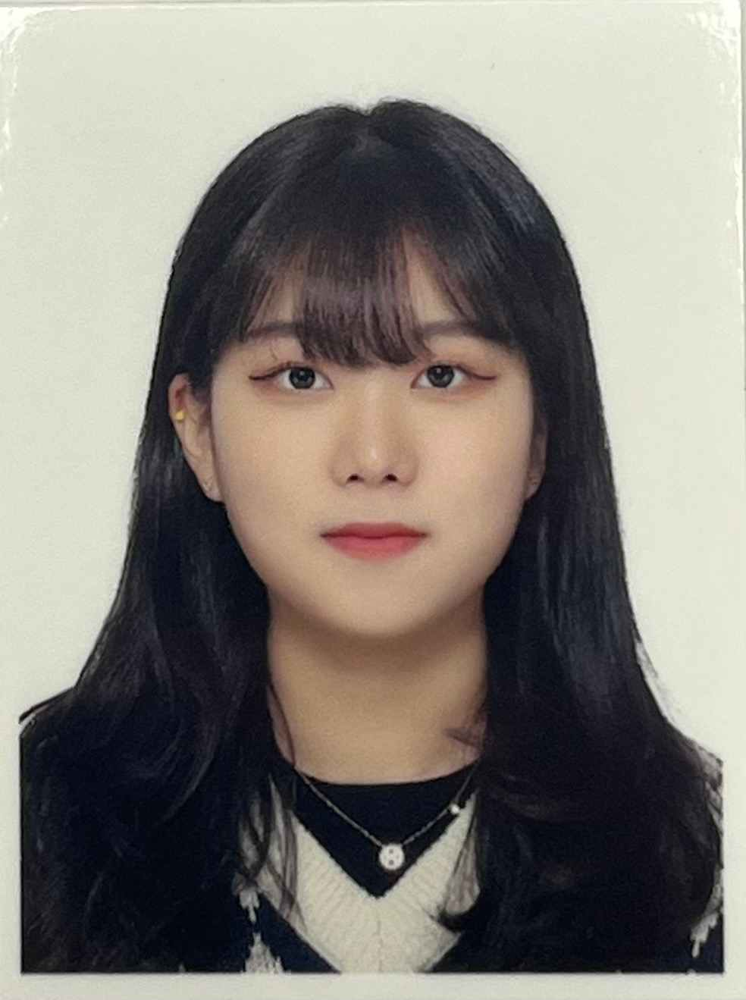

# Résumé
---
<table border="1" width="400">
    <tr>
        <th colspan="3">About Me.</th>
    </tr>
    <tr>
        <td rowspan="3"></td>
        <td>name(ko.)</td>
        <td style="text-align: center;">이승연</td>
    </tr>
    <tr>
        <td>name(en.)</td>
        <td style="text-align: center;"><em>Seung Yeon Lee</em></td>
    </tr>
    <tr>
        <td>Birth</td>
        <td style="text-align: center;"><i>2000.11.06</i></td>
    </tr>
</table>

---
>대학교: Hallym Univ.  
>소속: 정보과학대학   
>>주전공: 빅데이터전공   
>>>복수전공: 스마트IoT전공
---

| 1학년 | 2학년 | 3학년 | 4학년 |
|:-----:|:-----:|:-----:|:-----:|
| 컴퓨팅사고와 문제해결  | R언어   | 인공지능   | 연구프로젝트(Web-React)  |
|   이산구조론  |   논리설계 및 실험  |  웹 프로그래밍   |  웹 서버 구축   |
|  선형대수학   |  자료구조   |   데이터시각화  |  소프트웨어캡스톤디자인(졸업작품)   |
|   C프로그래밍  |   데이터베이스 기초  |  컴퓨터 구조   |  디지털신호처리   |
|     |   오픈소스 SW  |  프로그래밍 스튜디오(코딩테스트)   |  오픈소스리눅스실무   |
|     |     |  4차 산업혁명과 창업   | IoT플랫폼 설계    |

 
---
## 관심분야

* 웹 개발
* 백엔드 (서버관리 & 데이터 관리)
* 프론트엔드
* 데이터분석

---
## 프로그래밍 언어

1. Java
2. SQL
3. Python
4. R

---
## 활동사항

>20년도
* SW 인재 장학금
* 부스트코스 -Python교육 
  ▶Michigan대학에 Charles R.Severance 교수님이 현장에서 강의하시는 것을 듣고 퀴즈, 팀프로젝트를 참여하며 파이썬에 대한 지식을 쌓을 수 있었던 활동 
  ▶전공수업을 영어로 들을 수 있었던 색다른 경험이였고, 덕분에 영어실력 또한 향상
* 모두의 연구소 -풀잎스쿨 14기 수료 
  ▶SQL을 사용해서 의류데이터,게임사용자데이터 등등으로 데이터 분석하는 방법을 배웠던 활동 
  ▶파트를 나눠서 발표하는 방식의 프로젝트였기때문에 프로그래밍,데이터를 다루는 방법 이외에 프로젝트를 대하는 태도에 대해서도 많은 깨달음이 있었던 활동
>21년도
* 제 3대 빅데이터전공 학생회 'Plus' 대외국 부원
* 금융보안원/금융데이터거래소 주최 -금융데이터 경진대회 공모전 참가 
  ▶실제 하나은행의 데이터를 이용해서 코로나 팬데믹 이후 사람들의 경제패턴과 금융상품의 변화를 분석해보면서 팀원 한명과 함께 새로운 금융상품 아이디어를 제시했던 공모전
* 데이터사이언스 프로젝트 
  ▶노인 주거 복지 시설, 노인 의료 복지 시설비교
>22년도
* 제 4대 스마트IoT전공 학생회 '이음' 총무국 국장
* 서울아산병원 -'신약개발 지원 생태계 구축을 위한 AI교육' 수료 
  ▶의료데이터 분석에 관심이 많아서, 신청했던 교육 
  ▶학교 과목에서 배웠던 데이터분석법을 활용해 데이터모델링 실습을 성공적으로 끝낼 수 있었음. 
  ▶재직하고 계신 연구원분들과 함께해서 진로결정에 도움받음음. 

* [SW Week] SW창업 아이디어 경진대회 🏅본선 진출 
  ▶창업아이디어를 내고, 아이디어를 구체화시켜 발표함. 
  ▶플라스틱 컵으로 인한 사회적 이유를 활용해서 텀블러/리유저블 컵 사용을 독려하는 앱 기획
* [SW Week] Github 이력서 해커톤 경진대회
  
>23년도
* 제 5대 스마트IoT전공 학생회 'ToU' 부학회장
* 동계방학 Pre-Capstone
  ▶도서관 관리 프로그램
* 23-1학기 캡스톤 경진대회 🏅우수상 
  ▶AI를 활용한 면접 코칭 웹사이트
* SW 추천 장학금
* 강원SW사업단 주최 -강원SW 페스티벌 🏅우수상 
  ▶AI를 활용한 면접 코칭 웹사이트
* 리더십장학금
* 성적향상장학금
* [정보과학대학 학술제] -Web(완성작)분야 참가 🏅장려상 
  ▶MBTI Fall In Love

---
## 목표
 
* 웹/앱 서비스 기획,제작
>제작하고 싶은 프로젝트가 있을 때마다 기획하고 제작하는 실행능력
>독창성 있는 프로그램을 기획,제작하기 위해 끊임없이 아이디어를 생각할 것
>일생생활에서 필요하다고 생각한 서비스를 직접 개발하고 상용화 시킬 것 
* 변화 받아들이기
>미래에는 새로 생겨나는 직업도 많을 것이기 때문에, 모든 가능성을 열어두고 다방면의 기술을 빠르게 습득해야할 것이다.
* 프로젝트
>팀 프로젝트나 사이드 프로젝트를 통해 기술역량 발전하기.
---

